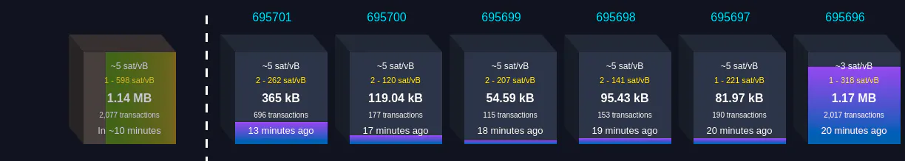

# Introduction to Bitcoin Script


We know the bitcoin ledger is nothing but a **Blockchain**. And a single entity of the blockchain is called **Block**.  A block is a container data structure that aggregates transactions for inclusion in the public ledger, the blockchain.


_Fig: The blocks in the Blockchain and one block waiting to be mined. Image Source:_ [https://mempool.space/](https://mempool.space/)

The structure of a block

|Size| Field | Description |
|---|---|---|
| 4 bytes | Block Size | The size of the block, in bytes, following this field |
| 80 bytes | Block Header | Several fields form the block header |
| 1 - 9 bytes (varInt) | Transaction Counter | How many transactions follow |
| Variable | Transactions | The transactions recorded in this block |

So each block has some transactions.


_Fig: An example of transactions in a block (in this case, block at height 695701). Image Source:_ [https://www.blockchain.com/](https://www.blockchain.com/)

Let's zoom deep into a single transaction.


_Fig: A single bitcoin transaction. Image Source:_  [https://mempool.space/](https://mempool.space/)

There are some mysterious scripts mentioned in every transaction. I have highlighted the scripts in the above image. In this blog, we will discuss what these scripts are.

## Dissecting a Transaction

An actual transaction looks very different from a transaction provided by a typical block explorer.  If we use the Bitcoin Core’s command-line interface (getrawtransaction and decoderawtransaction) to retrieve a "raw" transaction, decode it, and see what it contains. The result looks like this:

```json
{
  "version": 1,
  "locktime": 0,
  "vin": [
    {
      "txid": "7957a35fe64f80d234d76d83a2a8f1a0d8149a41d81de548f0a65a8a999f6f18",
      "vout": 0,
      "scriptSig" : "3045022100884d142d86652a3f47ba4746ec719bbfbd040a570b1deccbb6498c75c4ae24cb02204b9f039ff08df09cbe9f6addac960298cad530a863ea8f53982c09db8f6e3813[ALL] 0484ecc0d46f1918b30928fa0e4ed99f16a0fb4fde0735e7ade8416ab9fe423cc5412336376789d172787ec3457eee41c04f4938de5cc17b4a10fa336a8d752adf",
      "sequence": 4294967295
    }
  ],
  "vout": [
    {
      "value": 0.01500000,
      "scriptPubKey": "OP_DUP OP_HASH160 ab68025513c3dbd2f7b92a94e0581f5d50f654e7 OP_EQUALVERIFY OP_CHECKSIG"
    },
    {
      "value": 0.08450000,
      "scriptPubKey": "OP_DUP OP_HASH160 7f9b1a7fb68d60c536c2fd8aeaa53a8f3cc025a8 OP_EQUALVERIFY OP_CHECKSIG",
    }
  ]
}
```

Every transaction has some **inputs** and then some **outputs**. These transaction outputs are the fundamental building blocks of a bitcoin. So for instance, if you make a new transaction the inputs will be nothing but point to the outputs of some previous transactions which is in the blockchain. And the new outputs will now become available and spendable. These transaction outputs are actually known as **UTXO (Unspent Transaction Output)**. And the collection of all the UTXO is called the **UTXO set**.

**Transaction outputs consist of two parts:**

- An amount of bitcoin, denominated in  _satoshis_, the smallest bitcoin unit.
- A cryptographic puzzle that determines the conditions required to spend the output.
The cryptographic puzzle is also known as a  _locking script_, a  _witness script_, or a `scriptPubKey`.

**Transaction inputs consists of:**

- A **transaction ID**, referencing the transaction that contains the UTXO being spent
- An **output index** (`vout`), identifying from which UTXO  the transaction is referenced (the first one is zero)
- A **scriptSig**, which satisfies the conditions placed on the UTXO, unlocking it for spending
- A **sequence** number (to be discussed later)

We will mainly be focussing on the _cryptographic puzzle_ in the transaction output and the `scriptSig` in the transaction input.

## Script

In Bitcoin, the verification is done by executing a script. The scripting language is called **Script**.  It is very similar to Froth. Some of the properties of this language are:

### Stack Based Execution

Executing Script involves two stack operations `PUSH` and `POP`. Stack is a data structure that follows the _LIFO_ order (Last In First Out). The way the Bitcoin engine executes the script is, it reads the script from left to right, if there is data or value we will push it into the stack, else if there is some operation we will perform that particular operation. Depending on the type of operation some items might be popped from the stack. Let's take a simple example of a script

```bash
10 20 OP_ADD
```


In the bitcoin script, there are some reserved keywords and they are meant to perform special operations. These are called **Opcodes**. The opcodes are assigned a unique hex value like `OP_ADD` is `0x93`. Each opcode has its own function. Like `OP_ADD` pops two values from the stack, performs arithmetic addition, and then pushes the final result into the stack.


This is how the Bitcoin engine executes Script.

### Turing Incomplete

>The bitcoin transaction script language contains many operators, but is deliberately limited in one important way—​there are no loops or complex flow control capabilities other than conditional flow control. This ensures that the language is not _Turing Complete_, meaning that scripts have limited complexity and predictable execution times. The script is not a general-purpose language. These limitations ensure that the language cannot be used to create an infinite loop or another form of "logic bomb" that could be embedded in a transaction in a way that causes a denial-of-service attack against the bitcoin network. Remember, every transaction is validated by every full node on the bitcoin network. A limited language prevents the transaction validation mechanism from being used as a vulnerability.

Source: [Bitcoin Book Ch6](https://github.com/bitcoinbook/bitcoinbook/blob/develop/ch06.asciidoc)

## Why does Script has so many limitations?

The reason Script is a very simple language that was designed to be limited in scope:

1. To ensure it is able to run on a **range of hardware** from a simple wallet to a miner and doesn't need much processing power to execute the script and validate the transaction.
2. The fact that the Script language can't do everything any modern high-level language like C++, Java can; is a **deliberate security feature**.

But even after these restrictions Script provides a lot of flexibility, and there are various ways of making transactions as we will see later. But bitcoin-devs decided that only a few transactions should be considered `Standard` and these transactions should follow a particular format.

## Script Construction

### Locking Script

>A locking script is a spending condition placed on an output: it specifies the conditions that must be met to spend the output in the future.

Let's imagine a briefcase that is locked, now who do you think the briefcase belongs to? Obviously to the person who has the key to that lock. Similarly, if Alice sends Bob some coins, the output of that transaction will have a locking script. If Bob decides to spend those coins then Bob has to provide the appropriate unlocking script which only he has access to. Indirectly we can say that those coins are now locked to Bob's BTC address i.e belong to Bob.

Historically, the locking script was called a `scriptPubKey`, because it usually contained a public key or bitcoin address (public key hash).

### Unlocking Script

>An unlocking script is a script that "solves," or satisfies, the conditions placed on output by a locking script and allows the output to be spent.

Extending the previous example, if Bob now has to spend those coins by Alice he has to provide a suitable script that will "unlock" the locking script. In other words, if you want to give the briefcase to someone else you will have to unlock the lock with your key and then give it to the other person with their lock.

Historically, the unlocking script was called _scriptSig_, because it usually contained a digital signature. In most bitcoin applications.

## How does this "unlocking" happen?

A question might arise: how does this unlocking script actually unlock the locking script? What the Bitcoin Engine does is, first execute the unlocking script (remember stack-based execution), chances are there will be some data left in the stack which is vital information. Now the locking script will be executed on the stack (will need the previous data). If after complete execution of these two scripts the stack is empty or has a non-zero value or has True on top of the stack, then we can consider the scripts are compatible and the unlocking script is valid. Otherwise, the execution will be considered invalid and the UTXO will not be used.

---

I was a part of the [Summer of Bitcoin'21](https://summerofbitcoin.org/) at the time of writing this blog. I am grateful to [Adi Shankara](https://twitter.com/adibitcoin), [Caralie Chrisco](https://twitter.com/Caralie_C), [Adam Jonas](https://twitter.com/adamcjonas) for giving me this amazing opportunity and my mentor [0xb10c](https://twitter.com/0xB10C) for his guidance and support.
