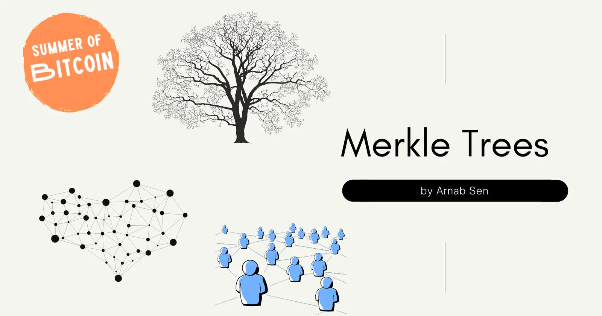
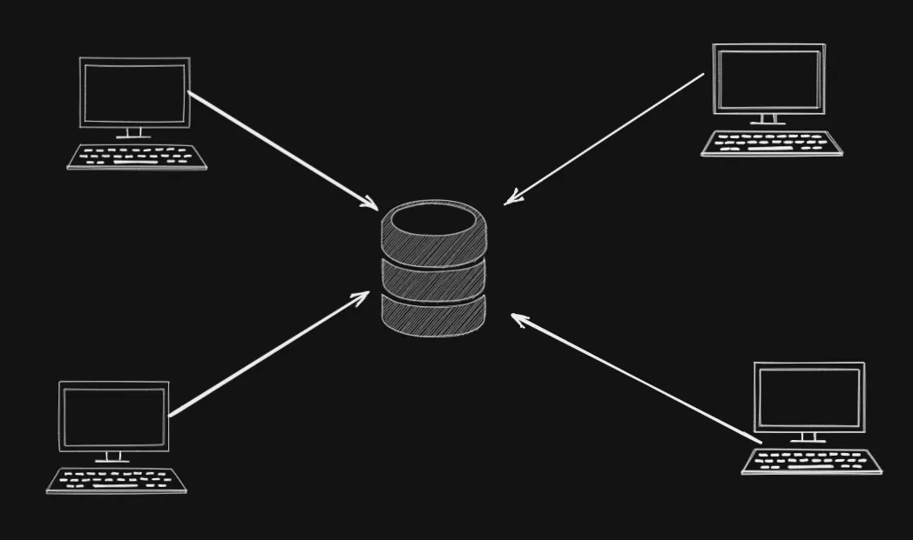
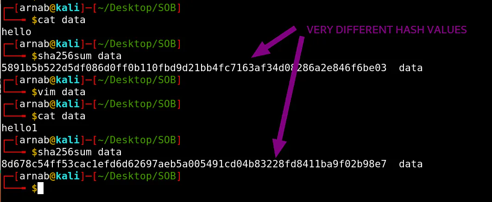
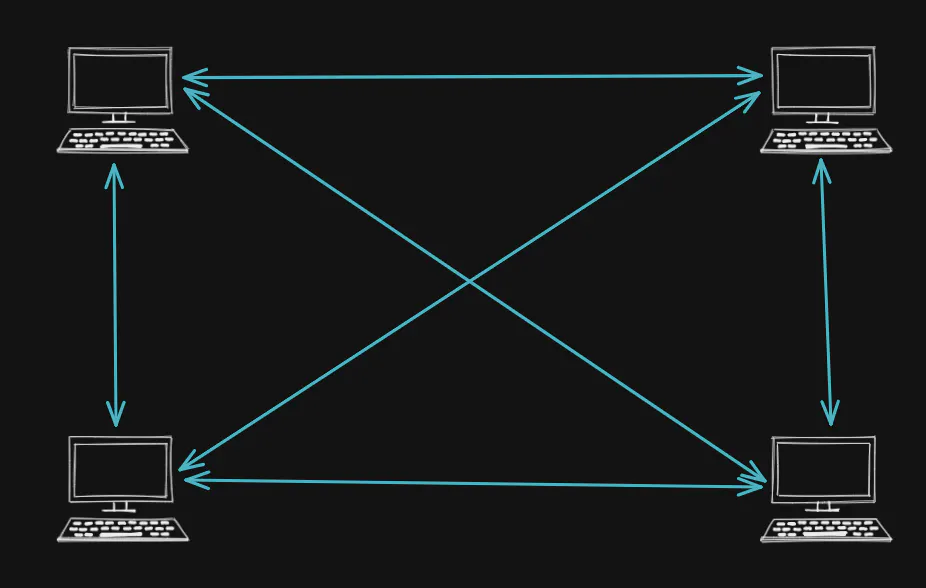
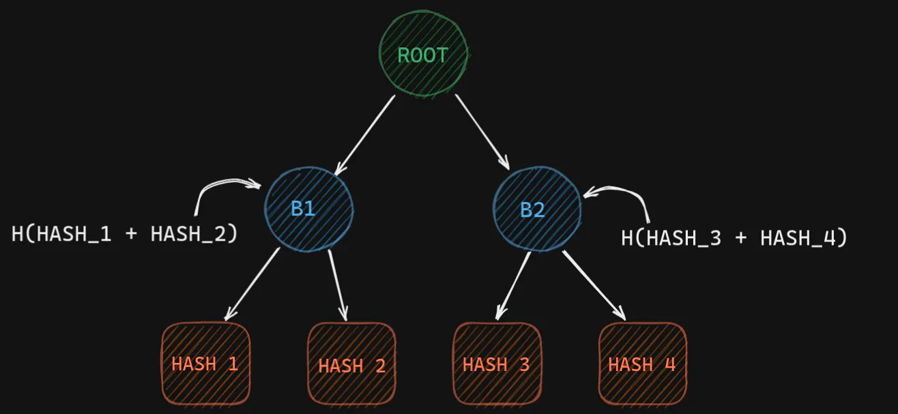
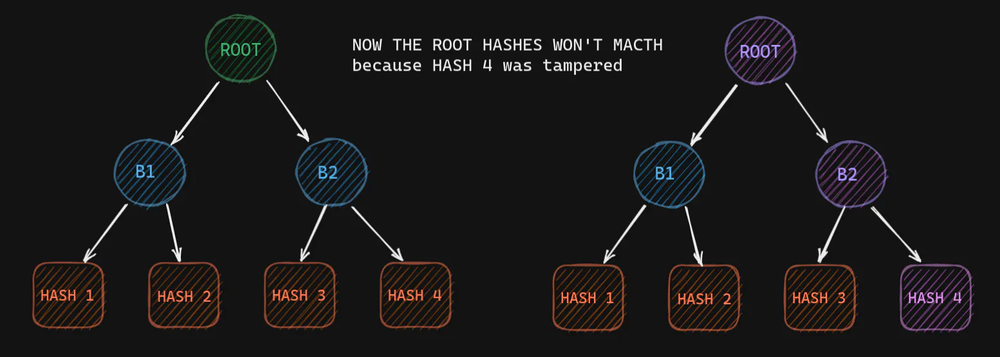
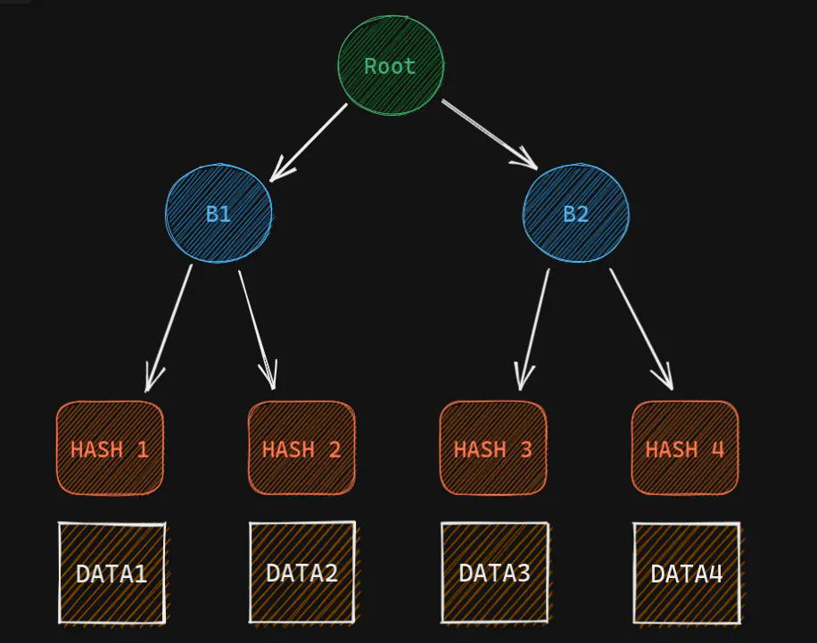
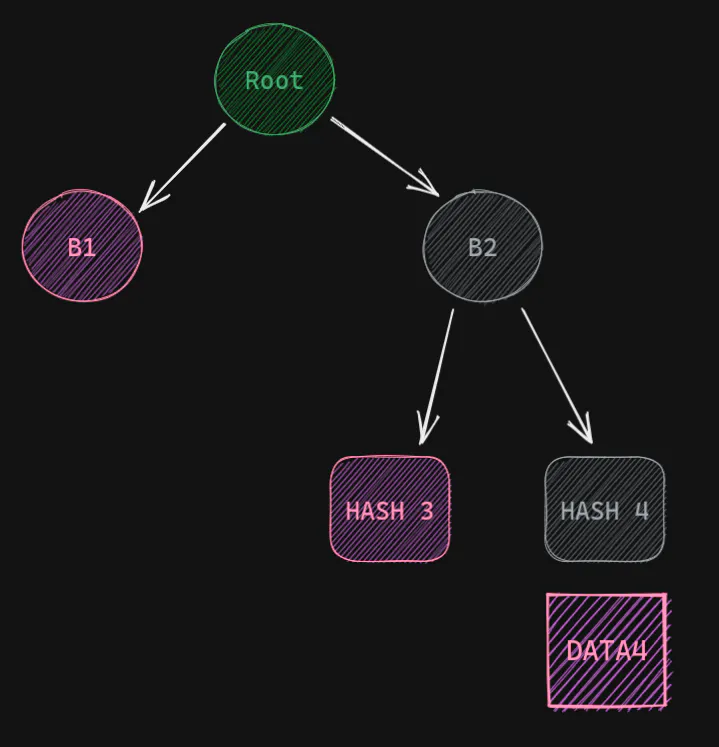

# Merkle Trees and its role in the decentralized web



## Centralised Web

*How does the web in general work?*

Usually, we have a server where we upload files, and then we can access those files from some other nodes connected to the network the server is connected to.

*For example*, if you want to host your videos for people to watch, you would rather choose Youtube or Google Drive or similar hosting/file-sharing services. Now, this is very convenient because a user doesn't have to maintain those services or manage them. But it comes at a cost. *The data is now concentrated on the infrastructure of a handful of providers.*



## Content Addressing

But we can avoid this if we use a **peer-2-peer system**, with the help of content addressing. Before diving into how the p2p system avoids decentralization let's first understand **content addressing**. So, depending on the value of the content we can generate an address. We can use a cryptographic hash function. One of the popular functions is the `SHA-256`. In your terminal, you can write this command.

```bash
sha256sum file # will generate the SHA-256 hash of the file.
```

Now even if you make a very small change, the sha256 value of the file will change drastically.



Now the output of this function (usually known as *hash* or *digest*) is of a fixed length. In the case of `SHA-256`, it's `32 bytes`. Also for each unique data, we will get a unique hash value. Thereby we can use the hash value for integrity check. As an analogy, if Alice and Bob are two different persons then quite naturally they will have different home addresses (not considering the exceptional cases, where Alice and Bob are roommates). So the home address in a way plays the role of identification for Alice and Bob. Similarly, the hash value plays the role of an address of the content (or data).

> The exceptional case where Alice and Bob are roommates is actually analogous to something called **Hash Collision**. Where two different values give the same hash, but it is very rare. So far no one has been able to find such values which give the same sha256 hash.

## Peer to Peer Network

Coming back to the peer-to-peer network. Instead of keeping the data in one server, we can share the data across multiple nodes (computers connected to the network are called **nodes**).



Now what are the pros:

1. It requires *less disk space* since the data is now shared among multiple peers.
2. If one node gets destroyed/tampered with the data can still be retrieved from the other node. Hence, no **single-point-of-failure**.

But there are some cons as well. Participants in a peer to peer cannot be trusted. So when we retrieve a file we have to ensure that it is in good condition and is not tampered with or it is not malicious. But how can we do that in an efficient manner? This is where **Merkle Trees** come into play.

## Merkle Trees

**Merkle trees are a data structure that allows us to do efficient data verification across networks. It is a binary tree where the nodes store hashes instead of chunks of data.**

> Merkle trees are named after **Ralph Merkle**, who proposed them in a 1987 paper titled *"A Digital Signature Based on a Conventional Encryption Function."* Merkle also invented cryptographic hashing.

The leaf nodes store the hashes of the chunks of the data. And their parent nodes store the hash of concatenating the hashes of left child and right child.

So, if we have 4 chunks of data. We first hash each one of them and get `Hash 1`, `Hash 2`, `Hash 3`, `Hash 4`.
Now we concatenate `Hash 1` and `Hash 2` and then calculate the hash of that concatenated string. That is stored in `B1` (Branch 1), similarly for `Hash 3` and `Hash 4`. We will keep doing this until we come to a single node in the tree which is called the root.



The root node has a special name in a Merkle Tree, we call it the **Root Hash**. And actually plays a big role in p2p networks.

### Checking Equality

Checking for equality becomes easy with Merkle Tree. *Why?* Let's say one of the leaves has different data (unintended/tampered data). Now the hash for the corresponding leaf will be different. As a result, the parent hash will also be different and so on till the root. So if any data is tampered with, the root hash will give us different values.



So a change in any leaf node will be bubbled to the root hash. Now that reduces the comparisons we need to make to check the equality. And all we need to send to verify the data is the root hash, which is just 256 bits (or 32 bytes).

This ease of verification plays a big role in the p2p network because all the peers are anonymous and are untrusted.

Now, let's say you are supposed to download a file from your peers. And you already have the root hash of the file you were supposed to get. You download the data from your peers. What you can now do is build the Merkle Tree and calculate the Root Hash and check if the calculated Root Hash matches with the one you are expecting. If it matches then we are 100% sure that the data wasn't accidentally corrupted or intentionally tampered with. If it doesn't match then the data is tampered with or it is malicious.

### Partial Verification

But why shall we go all the way to make a Merkle Tree and not just concatenate all the data and calculate the hash? The reason is **partial verification**. Sometimes we don't need the entire data set, only a couple of files are enough. We cannot verify that using the naive approach where we concatenated all the chunks of data and calculated the hash. But with the help of Merkle Trees, we can do it efficiently.

Let's say we have 4 chunks of data. Before uploading to the p2p network I create a Merkle tree and find the root hash.



Now we have saved the root hash safely. Now let's say we need Data 4. And one node says that it has the data. But how do we ensure that the data is not malicious?
First, we will get Data 4, so we can just hash it and get Hash 4. Then we will need Hash 3 (remember not Data 3, just the hash). Using Hash 4 and Hash 3 we can calculate hash B2. Then we will need B1 and using B2 and B1 we can calculate root hash, which we already have. So we can easily compare them. So what information did we need?

1. Data 4 (the chunk of data we need)
2. Hash 3
3. B2



That's it. For a bigger tree, we will just need one data and a couple of hashes. The hashes have a fixed size of 32 bytes, so it will save a lot of bandwidth. Also, the number of hashes will be logarithmic to the number of leaves i.e chunks of data. *This way Merkle Trees can ease the verification process.*

## Use cases

Merkle Trees are extensively used in Git, Bitcoin, and many other places. In Bitcoin specifically, it is used to validate transactions in a block. You can read more about it in the book [Grokking Bitcoin by Kalle Rosenbaum Section 6.5](http://rosenbaum.se/book/grokking-bitcoin.html#merkle-trees), the partial verification of Merkle Trees is used to check if a Transaction exists in a block.

Gaurav Sen has also explained the same concept by taking the case of Git. You can watch the video  [here](https://www.youtube.com/watch?v=qHMLy5JjbjQ).

---

I was a part of the [Summer of Bitcoin'21](https://summerofbitcoin.org/) when I came across the concept of Merkle Trees and understood the important role it plays in Bitcoin and Blockchain. I would like to thank [Kalle](https://twitter.com/kallerosenbaum) for explaining these concepts so beautifully. If you are new to bitcoin you should definitely check out his book [Grokking Bitcoin](https://www.manning.com/books/grokking-bitcoin). I am also grateful to [Adi Shankara](https://twitter.com/adibitcoin), [Caralie Chrisco](https://twitter.com/Caralie_C), [Adam Jonas](https://twitter.com/adamcjonas) for giving us this amazing opportunity.
