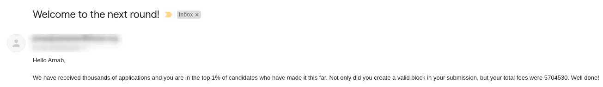

# My experience of Summer Of Bitcoin'21

On June 26, I received an email saying that I was one of the 50 students selected for the **Summer of Bitcoin 2021** program. I was really happy and felt proud of myself because to be very honest I didn't have high hopes at that point. In this blog, I will cover the selection process, my experience at Summer of Bitcoin will also share some tips for those who are interested in this program.

## About Summer of Bitcoin

A global program that matches students with open source, free software, and technology-related organizations working on bitcoin to write code and become part of these communities while making some BTC along the way! The organizations provide mentors who act as guides through the entire process, from learning about the community to contributing code. Students get involved in and become familiar with the bitcoin open source community and put their summer break to good use.

To know more visit the Summer Of Bitcoin [website](https://www.summerofbitcoin.org/).

## Selection Process

### How I came to know about the program

I was scrolling through LinkedIn when I came across a post. There was a form attached to it. It had some basic questions and a couple of essay questions like why do you want to take part etc. My tips would be to:

1. **Be truthful and original.** You have to understand that those who will select you are way more experienced than you so don't just copy-paste from random sites.
2. **Make sure you don't make any grammatical errors.** What I usually do is first write it down in Google Docs and use the spell-check. You can also install the [Grammarly](https://www.grammarly.com/) extension to avoid typos and grammatical errors.
3. **Gather information**. Go through the official websites, or take help from past participants. In my case, this was the first time, so there wasn't much public information available, but yeah I did visit the official website. The reason I am saying this is you can understand what the motive of the program is and then write your essays on the same line.

### Round 1: Problem Solving

*We are not supposed to discuss the problem and our approaches, so I would refrain from giving details*

It was not a typical CP question, rather was more real-life and bitcoin-related. We had to find an optimal solution but satisfy the conditions specified. And then submit our code. After spending around 2 days on the problem I was somewhat satisfied with my result, and I thought of submitting it. I also described my approach in a README file.

### Round 2: Follow up question

Then the next day I received a follow-up question in the email where I had to explain in detail a better approach to my previous solution. I had one more approach in my mind which I then explained and also proved how theoretically it is supposed to give a better solution.

And a few days later I received this mail:

Yayy !! My solution was in the top 1% among thousands of applicants. At this point, I was pretty confident.

### Round 3: "Navigating Ambiguity"

We were asked to find an issue in the official [Bitcoin](https://github.com/bitcoin/bitcoin) repo and explain what approach we would take to solve it. So I went to the issues tab and I didn't understand a single word. But I spent around 2 days trying to figure out the issues, even while doing this I learned a lot about fuzzing, AFL, and many other concepts.

### Round 4: Telephonic Interview

2 days later I received a calendly link for a telephonic round. In the telephonic round, I was asked to give a brief introduction of myself, my past experiences, and achievements, technical skills, and projects. Also, I was asked some questions like *why I wanted to be a part of this program* and *what my expectations are*.

After the call, my interviewer sent me a link for a video interview which was scheduled an hour later.

### Round 5: Final Interview

Here I was asked more about my knowledge of Bitcoin and Blockchain, which programming aspects I like to work on, and some more HR questions. I also asked him questions regarding the program. At the end of the conversation, I was pretty confident that I was able to ace it, cause I was getting positive vibes and my interviewer also shared some resources to get started (I have added them below).

## Sessions

We had some really amazing sessions with folks who are associated with Bitcoin for years. They have made contributions to the Bitcoin Core and other bitcoin-related projects, and every one of them shared their perspective towards Bitcoin and how revolutionary this concept of "Decentralised monetary system" is.

Here are some of the links to the recorded sessions:

- [The CS in Bitcoin with Sanket Kanjalkar](https://www.youtube.com/watch?v=lnEWDLScep0&t=17s)
- [Deep Dive Into Bitcoin Mechanics with Matthew Zipkin](https://www.youtube.com/watch?v=URMoDCCvjdI)
- [Decentralized open-source development with Amiti Uttarwar](https://www.youtube.com/watch?v=l-1Cur4I5yY)
- [Layering to Scale Bitcoin with Will Clark](https://www.youtube.com/watch?v=yZxwre6aT44)

You will find more at [Summer Of Bitcoin Youtube Channel](https://www.youtube.com/channel/UCu8iAf7tWfJNy2dcY7KvRBg/videos).

Then we had some lectures which were given by [Kalle Rosenbaum](https://twitter.com/kallerosenbaum), he is the author of the book **Grokking Bitcoin**. I would suggest this book to any beginner. The book explains how a system of Cookie Token used in a Cafe can be improved step by step and we will end up with a system like Bitcoin. The last day of the first week ended with experimenting with the `bitcoin-cli`. We created our own bitcoin full node in our machine and created a wallet. For testing purposes, we used the *signet*. Kalle gave us some coins which we then used to make transactions among our peers.

In between the lectures we used to have Breakout rooms that would give us a chance to discuss with peers and solve questions and resolve each other's doubts.

By the end of the first week, I went from having very little knowledge about Bitcoin to have a good grasp on fundamentals like consensus (proof-of-work), the P2P network, how bitcoin protocol upgrades take place, and innovations taking place in Bitcoin like the SegWit, Taproot, etc.

## Project Matching

Everyone was matched with a mentor and was assigned a Project. I was assigned with the amazing [0xB10C](https://b10c.me/) and my project was to improve the "User-Space, Statically Defined Tracing" (USDT) support for Bitcoin Core. For the next few weeks, we collaborated with our mentors and made contributions to the various projects at the same time reviewing each other's work.  I worked on adding some `utxocache` tracepoints for events like `flush`, `addCoin`, `spendCoin` etc. I learned a lot about the eBPF (extended Berkeley Packet Filter) technology, tracepoints, Linux Observability, navigating through large codebases like Bitcoin, and about opensource in general.

## Weekly Seminars

For the first 5 weeks, we also had weekly seminars on Bitcoin and Lightning Protocol Development. I was in the Bitcoin Protocol Development, so we had these topics:

**Week 1:** Welcome to Bitcoin Protocol Development
**Week 2:** Segwit
**Week 3:** Mining & Network Block Propagation
**Week 4:** P2P
**Week 5:** Script & Wallets

Every week, we would be matched with a random peer and assigned a particular question on the topic we had that week. We have to work with our partners to brainstorm answers for that question. Then every week we will meet in a breakout room and discuss our findings with everyone else. It was so much fun learning and sharing our research with our peers.

## Resources

1. [Grokking Bitcoin](https://rosenbaum.se/book/grokking-bitcoin.html) by [Kalle Rosenbaum](https://twitter.com/kallerosenbaum)
2. [Bitcoin and Cryptocurrency Technologies](https://www.coursera.org/learn/cryptocurrency).
3. [Mastering Bitcoin](https://github.com/bitcoinbook/bitcoinbook) for more technical insights.
4. [Onboarding to Bitcoin Core by Amiti Uttarwar](https://medium.com/@amitiu/onboarding-to-bitcoin-core-7c1a83b20365)
5. [Bitcoin Whitepaper](https://bitcoin.org/bitcoin.pdf)  (must read !!)
6. [Learning-Bitcoin-from-the-Command-Line](https://github.com/BlockchainCommons/Learning-Bitcoin-from-the-Command-Line)

After you have a good understanding of the fundamentals you can also dive into <https://chaincode.gitbook.io/seminars/> to get into the depth of each concept.

## Takeaways

Prior to this Summer Of Bitcoin, I had very little experience with cryptocurrency, blockchain, and also opensource. It was not just a bitcoin learning experience but we had career building, resume, and interview prep sessions too. I also kept a talk on Bitcoin Script. To make things even more amazing we also got some swags !! T-shirt and a Hardware Crypto Wallet.

But the most important takeaway would be the new connections I made, I made a lot of new friends who are really amazing at what they do, I am still working with mentor 0xB10C and I will be joining back this summer as a student coach for the next cohort.

## Final Notes

Since I was a part of the first cohort of Summer Of Bitcoin, the procedure was a bit different. This time they have made some updates in their application procedure and have also introduced Designer Track. You will find the new timeline on their [website](https://www.summerofbitcoin.org/apply). To keep getting updates follow [@summerofbitcoin](https://twitter.com/summerofbitcoin).

I would love to extend my gratitude to [Adi Shankara](https://twitter.com/adibitcoin), [Caralie Chrisco](https://twitter.com/Caralie_C), [Adam Jonas](https://twitter.com/adamcjonas) for giving us this amazing opportunity and my mentor 0xB10C for always helping me with my doubts. 0xB10C is very active in the Bitcoin Development Community you should definitely check out his work at [b10c.me](https://b10c.me/) and follow him [@0xB10C](https://twitter.com/0xB10C).

For those who are looking forward to applying for the next cohort of Summer of Bitcoin, all the very best. If you have any doubts or questions feel free to contact me, my DMs are always open.

- [@ArnabSen1729](https://twitter.com/ArnabSen1729)
- [LinkedIn](https://www.linkedin.com/in/arnabsen1729/)
- [Github](https://github.com/arnabsen1729)
- [Gmail](arnabsen1729@gmail.com)

*(Source: <https://www.summerofbitcoin.org/>)*
